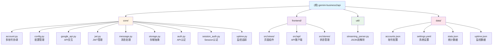

# CLAUDE.md

This file provides guidance to Claude Code (claude.ai/code) when working with code in this repository.

## 项目愿景

将 Gemini Business API 转换为 OpenAI 兼容接口，提供多账号负载均衡、图像生成、多模态能力与内置管理面板。核心目标是实现生产级的 API 网关，支持高并发、故障自动切换和完整的监控体系。

## 架构总览

### 核心设计原则

1. **前后端分离架构**：FastAPI 后端 + Vue 3 前端，支持独立部署（Vercel + HuggingFace）
2. **多账号协调**：轮询负载均衡 + 故障自动切换 + 429 限流冷却
3. **会话持久化**：基于对话指纹的 Session 缓存，支持上下文连续对话
4. **存储抽象层**：统一接口支持本地文件和 PostgreSQL 数据库
5. **零停机热更新**：配置变更实时生效，无需重启服务

### 技术栈

- **后端**：Python 3.11+, FastAPI 0.110, httpx (异步 HTTP), asyncpg (PostgreSQL)
- **前端**：Vue 3.5, Vite 7, Pinia (状态管理), TailwindCSS
- **部署**：Docker, HuggingFace Spaces, Vercel (前端)
- **存储**：本地文件 (data/) 或 PostgreSQL (HF Spaces)

### 数据流架构

```
客户端请求 (OpenAI 格式)
    ↓
FastAPI 路由 (/v1/chat/completions)
    ↓
API Key 验证 (可选)
    ↓
会话指纹生成 (前3条消息 + IP)
    ↓
Session 缓存查询
    ├─ 命中 → 使用已绑定账户
    └─ 未命中 → 轮询选择可用账户
        ↓
    创建 Google Session
        ↓
    文件上传 (图片/PDF/文档)
        ↓
    流式对话 (SSE)
        ├─ 文本内容 → 实时返回
        ├─ 思考过程 → reasoning_content
        └─ 生成图片 → 下载并返回 (Base64/URL)
            ↓
    错误处理与重试
        ├─ 429 限流 → 冷却 10 分钟后自动恢复
        ├─ 普通错误 → 切换账户重试 (最多 3 次)
        └─ 账户失败 → 永久禁用 (失败阈值 3 次)
```

## 模块结构图



## 模块索引

| 模块路径 | 职责 | 关键文件 |
|---------|------|---------|
| `core/` | 核心业务逻辑 | account.py, google_api.py, config.py |
| `core/account.py` | 多账号协调、轮询、故障切换 | AccountManager, MultiAccountManager |
| `core/google_api.py` | Google API 交互、Session 管理 | create_google_session, upload_context_file |
| `core/config.py` | 统一配置管理（环境变量 > YAML > 默认值） | ConfigManager, AppConfig |
| `core/storage.py` | 存储抽象层（文件/PostgreSQL） | load_accounts, save_accounts |
| `core/jwt.py` | JWT token 生成与刷新 | JWTManager |
| `core/message.py` | 消息解析、会话指纹生成 | get_conversation_key, parse_last_message |
| `core/auth.py` | API Key 验证 | verify_api_key |
| `core/session_auth.py` | Session 认证（管理面板） | login_user, require_login |
| `core/uptime.py` | Uptime 监控追踪 | UptimeTracker |
| `frontend/` | Vue 3 管理面板 | Dashboard, Accounts, Settings, Logs, Monitor |
| `util/streaming_parser.py` | JSON 数组流解析器 | parse_json_array_stream_async |
| `main.py` | FastAPI 应用入口 | 路由定义、中间件、启动逻辑 |

## 运行与开发

### 本地开发

```bash
# 1. 部署（自动构建前端 + 安装依赖）
bash deploy.sh  # Linux/macOS
deploy.bat      # Windows

# 2. 配置环境变量
cp .env.example .env
# 编辑 .env 设置 ADMIN_KEY

# 3. 启动服务
python main.py  # 默认端口 7860

# 4. 前端开发（可选）
cd frontend
npm run dev  # 开发服务器 http://localhost:5173
```

### Docker 部署

```bash
# 构建镜像
docker build -t gemini-business2api .

# 运行容器
docker run -d -p 7860:7860 \
  -e ADMIN_KEY=your_admin_key \
  -v ./data:/app/data \
  gemini-business2api

# 或使用 docker-compose
docker-compose up -d
```

### 前后端分离部署

```bash
# 后端：HuggingFace Spaces
# 1. 设置环境变量：ADMIN_KEY, DATABASE_URL (PostgreSQL)
# 2. 推送代码到 HF Spaces

# 前端：Vercel
cd frontend
npm run build  # 构建到 dist/
# 部署到 Vercel，设置环境变量：
# VITE_API_BASE_URL=https://your-hf-space.hf.space
```

### 更新

```bash
bash update.sh  # 自动备份配置、拉取代码、更新依赖
```

## 测试策略

### 当前状态
- **无单元测试**：项目未包含测试文件
- **手动测试**：通过管理面板和 API 端点验证功能
- **监控验证**：依赖 Uptime 追踪器和日志系统

### 推荐测试方法

1. **API 端点测试**
   ```bash
   # 测试 OpenAI 兼容接口
   curl -X POST http://localhost:7860/v1/chat/completions \
     -H "Content-Type: application/json" \
     -d '{"model":"gemini-auto","messages":[{"role":"user","content":"Hello"}]}'
   ```

2. **管理面板测试**
   - 访问 http://localhost:7860/
   - 使用 ADMIN_KEY 登录
   - 验证账号管理、设置、日志、监控功能

3. **多账号故障切换测试**
   - 配置多个账号（至少 2 个）
   - 手动禁用一个账号
   - 发送请求验证自动切换

4. **429 限流恢复测试**
   - 触发 429 错误（高频请求）
   - 验证账号进入冷却期（10 分钟）
   - 验证冷却期后自动恢复

## 编码规范

### Python 代码风格

1. **模块化设计**：核心逻辑拆分到 `core/` 目录，避免 `main.py` 过度膨胀
2. **类型注解**：使用 `TYPE_CHECKING` 避免循环导入，关键函数添加类型提示
3. **异步优先**：所有 I/O 操作使用 `async/await`，避免阻塞事件循环
4. **错误处理**：使用 `HTTPException` 返回标准错误，记录详细日志
5. **日志规范**：
   ```python
   logger.info(f"[MODULE] [{account_id}] [req_{request_id}] 操作描述")
   ```

### 关键设计模式

1. **单例模式**：`ConfigManager`, `MultiAccountManager` 全局唯一实例
2. **工厂模式**：`load_multi_account_config()` 创建账号管理器
3. **策略模式**：存储抽象层支持文件/数据库切换
4. **观察者模式**：配置热更新通过 `config_manager.reload()` 触发

### 前端代码风格

1. **组合式 API**：使用 Vue 3 Composition API (`<script setup>`)
2. **状态管理**：Pinia stores 管理全局状态（auth, accounts, settings）
3. **API 封装**：统一封装到 `src/api/` 目录
4. **组件复用**：通用 UI 组件放在 `src/components/ui/`

## AI 使用指引

### 关键架构决策

1. **为什么使用会话指纹而非简单的 request_id？**
   - 支持上下文连续对话（同一对话复用 Session）
   - 基于前 3 条消息 + IP 生成，避免不同用户冲突
   - 参考：`core/message.py:get_conversation_key()`

2. **为什么 429 错误不增加 error_count？**
   - 429 是临时限流，不是账号失效
   - 冷却期后自动恢复，避免误判永久禁用
   - 参考：`core/account.py:should_retry()`

3. **为什么配置分为安全配置和业务配置？**
   - 安全配置（ADMIN_KEY）仅从环境变量读取，防止 Web 修改
   - 业务配置支持热更新，无需重启服务
   - 参考：`core/config.py:ConfigManager.load()`

4. **为什么使用存储抽象层？**
   - HuggingFace Spaces 无持久化存储，需要数据库
   - 本地开发使用文件存储，生产环境使用 PostgreSQL
   - 参考：`core/storage.py`

### 常见修改场景

#### 添加新的配置项

1. 在 `core/config.py` 中定义配置模型：
   ```python
   class NewFeatureConfig(BaseModel):
       enabled: bool = Field(default=True)
   ```

2. 添加到 `AppConfig`：
   ```python
   class AppConfig(BaseModel):
       new_feature: NewFeatureConfig
   ```

3. 在 `ConfigManager.load()` 中加载：
   ```python
   new_feature_config = NewFeatureConfig(**yaml_data.get("new_feature", {}))
   ```

4. 更新管理面板 API：`/admin/settings` GET/PUT

#### 添加新的 API 端点

1. 在 `main.py` 中定义路由：
   ```python
   @app.post("/v1/new-endpoint")
   async def new_endpoint(req: Request):
       # 实现逻辑
   ```

2. 如需认证，添加装饰器：
   ```python
   @require_login()  # Session 认证
   # 或
   verify_api_key(API_KEY, authorization)  # API Key 认证
   ```

3. 前端添加 API 客户端：`frontend/src/api/new-feature.ts`

#### 修改账号选择策略

当前策略：轮询 + 跳过不可用账号

修改位置：`core/account.py:MultiAccountManager.get_account()`

示例：改为随机选择
```python
import random
available = [acc for acc in self.accounts.values() if acc.should_retry()]
return random.choice(available)
```

### 调试技巧

1. **查看实时日志**
   - 管理面板：http://localhost:7860/#/logs
   - 公开日志：http://localhost:7860/public/log

2. **查看账号状态**
   - 管理面板：http://localhost:7860/#/accounts
   - API：`GET /admin/accounts`

3. **查看监控数据**
   - 管理面板：http://localhost:7860/#/monitor
   - API：`GET /public/uptime`

4. **调试会话缓存**
   ```python
   # 在 main.py 中添加调试端点
   @app.get("/debug/cache")
   async def debug_cache():
       return {
           "cache_size": len(multi_account_mgr.global_session_cache),
           "cache_keys": list(multi_account_mgr.global_session_cache.keys())
       }
   ```

### 性能优化建议

1. **连接池调优**
   - 当前：`max_keepalive_connections=100, max_connections=200`
   - 高并发场景可适当增加

2. **缓存清理间隔**
   - 当前：5 分钟清理一次过期缓存
   - 修改：`MultiAccountManager.start_background_cleanup()`

3. **Session TTL**
   - 当前：1 小时（3600 秒）
   - 修改：`settings.yaml` 中的 `retry.session_cache_ttl_seconds`

4. **图片下载超时**
   - 当前：3 分钟（180 秒）
   - 修改：`core/google_api.py:download_image_with_jwt()` 的 `timeout` 参数

## 变更记录 (Changelog)

### 2026-01-16 - 初始化 CLAUDE.md
- 创建项目架构文档
- 记录核心设计决策
- 添加开发指引和调试技巧
